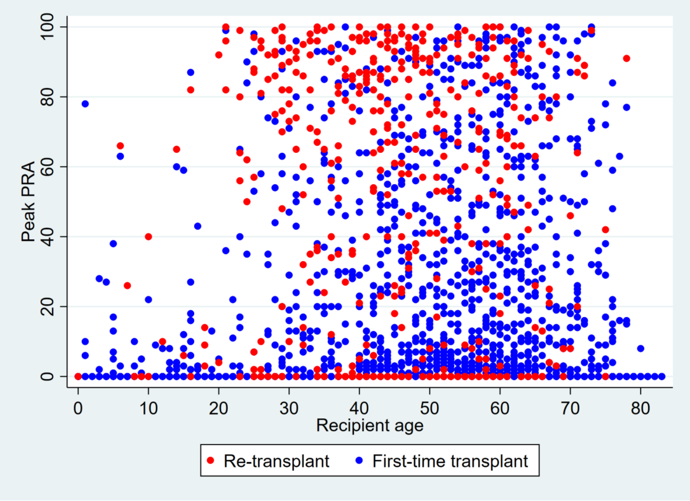
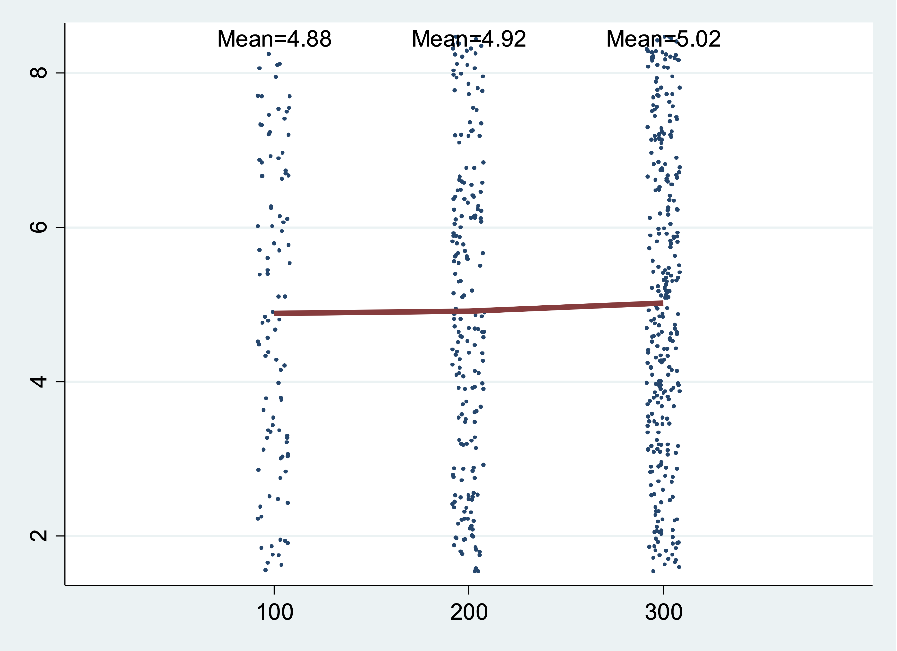

# Homework 7

**NOTE:** The figures you are going to "replicate" have a "Classic" Stata look. However, Stata made some drastic changes in the Spring of 2023 with the release of Stata 18. You'll get full points if your `.do` file script reproduces these color formats regardless of the Stata version running on our computers. Embrace Stata version, `c(version)`, ambiguity! **See below**

```stata
global repo https://github.com/jhustata/basic/raw/main/

//Let us pay homage to "Classic" Stata color schemes in our final homework!
if c(version)>17 {  
    set scheme s2color //stcolor is the default in Stata 18
}
else { 
    di "you're good to go!"
}
```

(late assignments will not be accepted for graduating students)

Write a .do file which performs the tasks described below. Your .do file should be called
`hw3.lastname.firstname.do`. Do **not** submit your log files as part of the assignment.

### Codebook

| Variable            | Description                                          | **Values**          |
| ------------------- | ---------------------------------------------------- | ------------------- |
| **transplants.dta** |                                                      |                     |
| `ctr_id`            | Center ID                                            | Integer             |
| `transplant_date`   | Date of transplant                                   | Date                |
| `prev_ki`           | Recipient has history of previous kidney transplant? | Binary (1=Yes/0=No) |
| `age`               | Recipient’s age                                      | Integer             |
| `bmi`               | Recipient’s BMI                                      | Numeric             |

### Question 1

Clear the memory and load `tx.dta`. <u>Drop all observations</u> with missing values on `transplant_date`. Reproduce the following graph as precisely as possible.

This graph shows a line plot of the number of cases performed in each calendar year. Be mindful about
the thickness of the line, the main title, and the axis labels and titles.

```stata
use ${repo}tx, clear
gen year = year(transplant_date)

```

Save the graph as `q1_[yourname].png`  

  

### Question 2

Clear the memory and load `tx.dta`. <u>Drop all observations</u> with missing values on `peak_pra`. Reproduce the following graph as precisely as possible.

This graph shows a scatter plot of `peak_pra` and `age`, stratified by `prev_ki`. Observations with
`prev_ki == 1` are shown in red. Be mindful about the color (“blue” and “red” in Stata color codes) and
size of the markers, the axis titles, and the legend.

Save the graph as `q2 _[yourname].png`  

 

### Question 3

Clear the memory and load `tx.dta`. <u>Drop all observations</u> with missing values for `peak_pra`. Reproduce the following graph as precisely as possible.

Calculate the average of `peak_pra` at each transplant center (`ctr_id`). Display the average value of
`peak_pra` after sorting. The location of the text label “National Average” can be hardcoded (i.e.
manually specify the location; about x=7 and y=17). Other markers and lines should NOT be hardcoded
and should be derived by your script using the dataset.

Save the graph as `q3 _[yourname].png`  

  

### Additional Credit (Maximum $+5$)

##### Use the Extra credit challenge DropBox

Write a program called `sampmean` to plot random data drawn from a normal distribution. `sampmean` takes a list of numbers representing different sample sizes. It also takes (optionally) a mean and standard deviation for the normal distribution. If we run

```stata
sampmean, at(5 20 100 1000) mean(20)
```

We get a graph like this:

 

In this example, the program generates four sets of normally distributed random numbers (one set of 5
numbers, one set of 20, one set of 100, and one set of 1000) and calculates the mean for each set. It also
plots each randomly generated number (as points) and the group mean (as a red line). The group mean
also appears above each group as text.

Here are some more examples. The exact output will depend on the random number seed you use.

```stata
sampmean, at (4 8 16 32 64) mean(5) sd(3)
```

  

```stata
sampmean, at(100 200 300) mean(5) sd(2) uniform
```

 

In the last example, the distribution is a uniform distribution instead of a normal distribution.

Hints:

- You can use the keyword `numlist` (for a list of numbers) just as you do with a `varlist` (list
    of variables)
- The uniform distribution from 0 to 1 has mean 0.5 and standard deviation sqrt(1/12).

**Note: this problem is pretty hard!** We expect that few people will solve the whole thing, but we will
give partial credit for a partial (working) solution. If your program only works partly, then explain in the
comments, like this:
 
