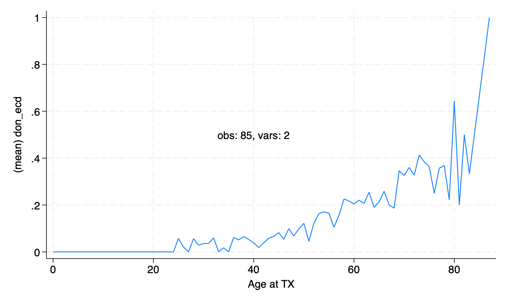

# lab7 Solutions

Please use this lab as an opportunity to review the course material and prepare yourself for `hw7`. Sample responses to the lab questions are provided below.

```stata
global repo https://github.com/jhustata/basic/raw/main/
```

1. Start Stata, open your do-file editor, write the header, and load `transplants.dta`.

```stata
use "${repo}transplants", clear
```

2. Get a 10% random sample of the dataset. Specifically, follow these steps. (1) Set a seed number. (2) Generate a variable that includes a random number between 0 and 1 following a uniform distribution. (3) Sort by the random variable. (4) Keep the first 10% observations and drop the rest. (5) Drop the random variable.

   ```stata
   count
   set seed 2024
   gen rdm=runiform()
   sort rdm
   keep if _n<=_N/10
   drop rdm
   count
   
   //alternative
   use transplants, clear
   count
   sample 10
   count
   ``` 

3. Clear and reload `transplants.dta`.

```stata
use "${repo}transplants", clear
```

4. Generate a variable called `fake_age` which is a normally distributed random variable with mean and standard deviation equal to the mean and standard deviation of the actual age variable.

   ```stata
   set seed 123
   sum age age
   g fake_age=rnormal(r(mean), r(sd))
   compare age fake_age
   kdensity age, addplot(kdensity fake_age)
   list fake_id age fake_age in 1/10
   graph export kdensity.png, replace 
   ```

   

5. Make a scatter plot of peak PRA by age in transplant recipients. Does it look like there's a relationship between peak PRA and age, and if so, what is the relationship?

```stata
use "${repo}transplants", clear 
graph twoway scatter peak_pra age    //full syntax
tw sc peak_pra age                 //abbreviated syntax
   
//explore other twoway options!!  
#delimit ;
forval f=0/1 { ;
	sum peak_pra if gender==`f', d ;
	local m_iqr_`f': di 
       "Median" %2.0f r(p50)
       " (IQR," %2.0f r(p25)
            "-" %2.0f r(p75)
            ")"
			;
} ;
tw (sc peak_pra age if gender==0)
   (sc peak_pra age if gender==1,
       legend(
           on
           ring(0)
           pos(11)
           lab(1 "Male")
           lab(2 "Female")
       )
       ti("Most Recent Serum PRA",pos(11))
       yti("%", orientation(horizontal))
   text(50 10 "`m_iqr_0'",col(midblue))
   text(45 10 "`m_iqr_1'",col(cranberry))
   )
   ;
   #delimit cr
   graph export lab6q5.png, replace 
```


6. The graph of proportion of ECD transplants by age from the lecture was a little messy. Remake the graph with the age rounded to the nearest ten years.

```stata
use "${repo}transplants", clear
collapse (mean) don_ecd, by(age)
graph twoway line don_ecd age, text(.5 40 "obs: `c(N)', vars: `c(k)'")
graph export collpasebyage.png,replace
count 
     
//alternative, without messing up the data
if c(N) == r(N) | c(N) == 6000 {
	
use transplants, clear
egen m_don_ecd=mean(don_ecd), by(age)
egen agetag=tag(age)
#delimit ;
line m_don_ecd age if agetag, 
    text(
    .5 40 
    "obs: `c(N)', vars: `c(k)'"
    ) 
    sort ;
#delimi cr
count
graph export lab6q6.png,replace 

}
```




     
```stata
use "${repo}transplants", clear
gen age10 = round(age, 10)
     //one way to restore data after messing it up
     preserve 
         collapse (mean) don_ecd, by(age10)
         graph twoway line don_ecd age10
         graph export collpasebyage10.png,replace
     restore 
     count 
 
```

7. You have all your commands in your do file, right? Run your do file from the beginning and make sure your do file does exactly the same thing. 


